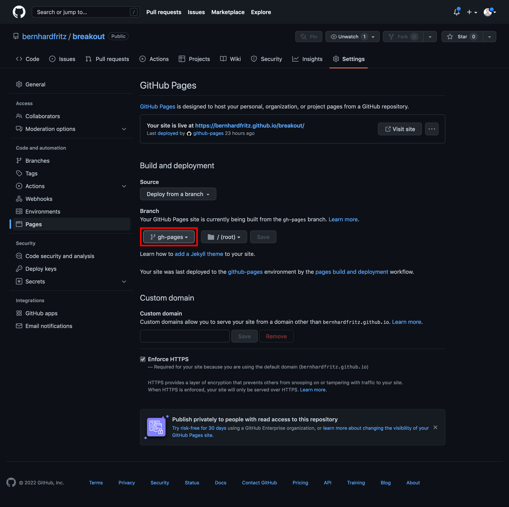

# cookiecutter-p8g

[Cookiecutter](https://github.com/cookiecutter/cookiecutter) template for a p8g project.

## Features

- Choose between npm and yarn
- Deploy to GitHub Pages workflow

## Usage

Let's pretend you want to create a project called "Breakout". Rather than starting from scratch, get cookiecutter and let it do all the bootstrapping work for you.

First, get Cookiecutter. Trust me, it's awesome:

```bash
pip install cookiecutter
```

Alternatively, you can install cookiecutter with homebrew:

```bash
brew install cookiecutter
```

Finally, to run it based on this template, type:

```bash
cookiecutter https://github.com/bernhardfritz/cookiecutter-p8g
```

You will be asked about some basic info (project name, package manager, etc.). This info will be used to customize your new project. There is no need to provide input if you are content with the default values enclosed in brackets.

Answer the prompts with your own desired options. For example:

```text
project_name [Hello rectangle]: Breakout
project_slug [breakout]:
Select package_manager:
1 - npm
2 - yarn
Choose from 1, 2 [1]: 2
```

This will generate the "Hello rectangle" code example, install dependencies and initialize git.

In order for your project to be deployed to GitHub Pages, all you need to do is to configure the `gh-pages` branch to be used as a publishing source:



## Projects built with cookiecutter-p8g

- [Breakout](https://github.com/bernhardfritz/breakout)
